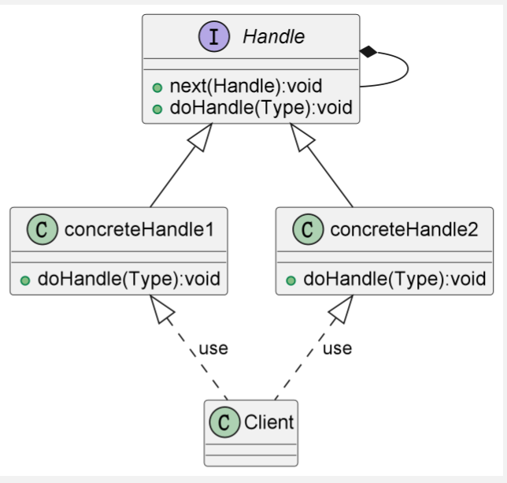
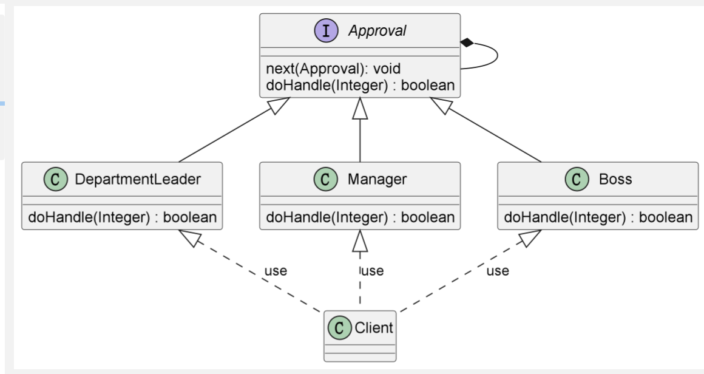

# 责任链模式

## 使用场景

> 将多个对象组成一条链式组合，从链条中寻找对应的解决方案，
> 直到处理完成未知。

1. 多选择式处理
2. 多重校验

## 角色关系

- 抽象处理者（**Handle**）
> 定义公共处理请求的接口
- 具体处理者（**Concrete Handle**）
> 具体请求处理者，如果能处理就进行处理，否则继续将请求往下传
- 客户端
> 具体的使用者

## 优缺点

1. 将发送者与处理者解耦
2. 易于扩展,符合开闭原则
3. 当链条过长时，可能导致性能降低。
4如果将链条拼成环行，将导致死循环,导致系统崩溃。

## 类图



## 使用案例

### 审批案例

#### 需求

> 小明向公司申请出去玩。这花钱的事需要领导审批，而每个领导权限不一样，
> 能够审批的最大金额有限制。小王首先肯定是向自己的部门领导提出，但是由于金额太大，
> 超出了他的审批权限。于是部门领导就去找自己的领导，经理，但是经理也不能处理这么多钱，
> 最后到了老板哪里,然后老板就让他滚蛋了..

#### 类图



#### 实现

* 抽象接口

```java
public interface ApprovalHandle {

    void next(ApprovalHandle approveHandle);

    boolean doHandle(Integer memory);

}
```

* 部门领导

```java
public class DepartmentLeader implements ApprovalHandle {
    protected ApprovalHandle handle;

    @Override
    public void next(ApprovalHandle approveHandle) {
        this.handle = approveHandle;
    }


    @Override
    public boolean doHandle(Integer memory) {
        if (memory < 2000 && memory > 0) {
            System.out.println("我是部门领导,我只能处理小于2000的钱");
            return true;
        }
        return handle.doHandle(memory);
    }
}
```

* 经理

```java
public class Manager implements ApprovalHandle {

    protected ApprovalHandle handle;

    @Override
    public void next(ApprovalHandle approveHandle) {
        this.handle = approveHandle;
    }

    @Override
    public boolean doHandle(Integer memory) {
        if (memory < 100000) {
            System.out.println("我是经理,可以处理10万以下的钱");
            return true;
        }
        return handle.doHandle(memory);
    }
}
```

* 老板

```java
public class Boss implements ApprovalHandle {
    protected ApprovalHandle handle;

    @Override
    public void next(ApprovalHandle approveHandle) {
        this.handle = approveHandle;
    }


    @Override
    public boolean doHandle(Integer memory) {
        System.out.println("我是老板,我想怎么样就怎么样,还想出去玩,等下给你优化了");
        return true;
    }
}
```